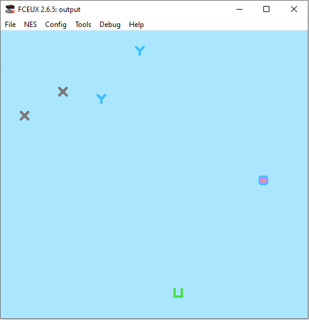

# 6502-enemy-spawn

## ASM array of structures method for spawning enemies

Based on: https://famicom.party/book/17-objectpools/

To assemble:

ca65 src/main.asm
ca65 src/reset.asm
ca65 src/enemies.asm

ld65 src/main.o src/reset.o src/enemies.o -C nes.cfg -o output.nes

Screenshot:

